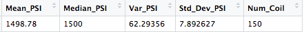
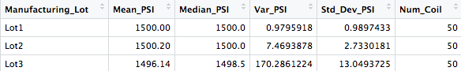
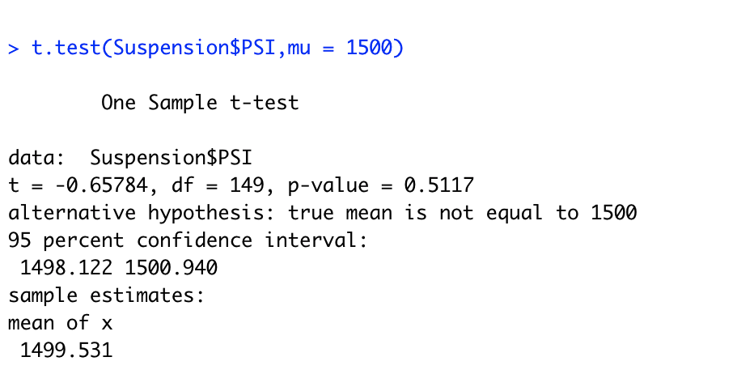
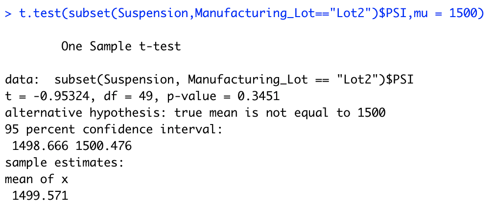
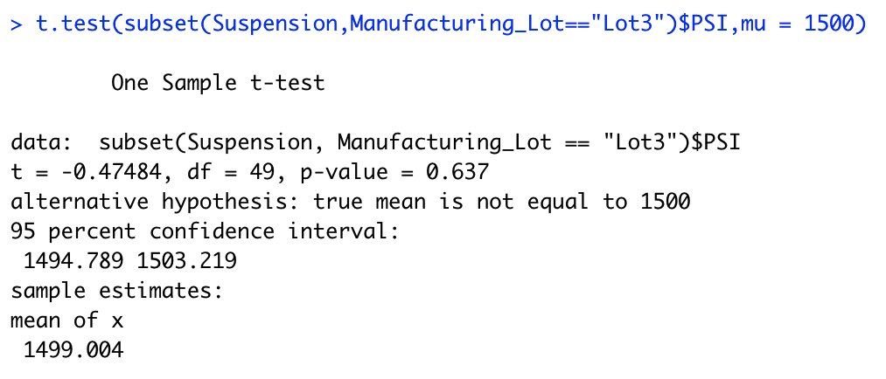

# MechaCar_Statistical_Analysis
## Overview of Project
A few weeks after starting his new role, Jeremy is approached by upper management about a special project. AutosRUs’ newest prototype, the MechaCar, is suffering from production troubles that are blocking the manufacturing team’s progress. AutosRUs’ upper management has called on Jeremy and the data analytics team to review the production data for insights that may help the manufacturing team.

In this challenge, you’ll help Jeremy and the data analytics team do the following:

* Perform multiple linear regression analysis to identify which variables in the dataset predict the mpg of MechaCar prototypes

* Collect summary statistics on the pounds per square inch (PSI) of the suspension coils from the manufacturing lots

* Run t-tests to determine if the manufacturing lots are statistically different from the mean population

* Design a statistical study to compare vehicle performance of the MechaCar vehicles against vehicles from other manufacturers. For each statistical analysis, you’ll write a summary interpretation of the findings.

## Deliverable 1: Linear Regression to Predict MPG
### Regression: mpg = (6.267)vehicle_length + (0.0012)vehicle_weight + (0.0688)spoiler_angle + (3.546)ground_clearance + (-3.411)AWD + (-104.0)

Which variables/coefficients provided a non-random amount of variance to the mpg values in the dataset?

* Vehicle weight, spoiler_angle & AWD provided a non-random amount of variance. However, there were two variables that had the most amount of random variance, ground_clearance and vehicle_length.

Is the slope of the linear model considered to be zero? Why or why not?

* The slope is NOT zero since the p-value is less than 0.05.

Does this linear model predict mpg of MechaCar prototypes effectively? Why or why not?

* The R-squared value is 71%, which means that an estimated 71% of the time our model will predict mpg values correctly. This means our regression most likely suffers from omitted variable bias.

## Deliverable 2: Summary Statistics on Suspension Coils
### Total Summary

### Lot Summaries

* The MechaCar suspension coils determine that the variance of the suspension coils cannot exceed 100 lbs. per inch squared.

* Lot 1 and Lot 2 are both within design specifications. Furthermore, they both contain almost the same mean and median. Lot 3, on the other hand, displays the most variance, and it exceeds the manufacturers specs.

## Deliverable 3: T-Test on Suspension Coils
### Across all lots

* According to our calculations, the true mean of the sample is 1498.78. The PSI values are not different from the population mean. The p-Value is 0.06, which is larger than 0.05. Thus, there is NOT enough evidence to support rejecting the null hypothesis. 

### Lot 1

* The lot 1 sample has the true sample mean of 1500, as seen in the summary statistics. With a p-Value of 1, we cannot reject the null hypothesis. Therefore, there is no statistical difference between the observed sample mean and the presumed population mean.

### Lot 2

* The lot 2 sample has the same outcome with a sample mean of 1500.02. With a p-Value of 0.61, we once again cannot reject the null hypothesis. Finally, the sample mean and the population mean of 1500 are statistically similar.

### Lot 3

* The lot 3 sample mean is 1496.14 and the p-Value is 0.04. The p-Value is smaller than 0.05, which means we should reject the null hypothesis that the sample mean and the presumed population mean are not statistically different.

## Deliverable 4: Design a Study Comparing the MechaCar to the Competition

